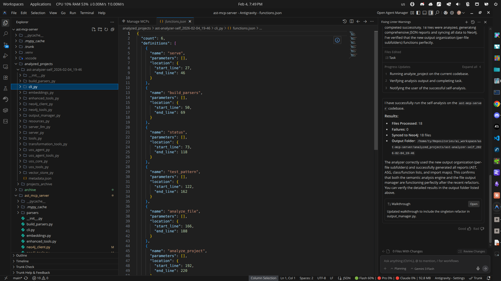

# AST MCP Server

An MCP (Model Context Protocol) server that provides code structure and semantic analysis capabilities through Abstract Syntax Trees (AST) and Abstract Semantic Graphs (ASG).

## Features

- Parse code into Abstract Syntax Trees (AST)
- Generate Abstract Semantic Graphs (ASG) from code
- Analyze code structure and complexity
- Support for multiple programming languages (Python, JavaScript, TypeScript, Go, Rust, C/C++, Java)
- Compatible with Claude Desktop and other MCP clients
- Incremental parsing for faster processing of large files
- Enhanced scope handling and more complete semantic analysis
- AST diffing to identify changes between code versions
- Resource caching for improved performance

## Installation

### Prerequisites

- Python 3.9 or higher
- [uv](https://docs.astral.sh/uv/) package manager (recommended) or pip

### Using uv (Recommended)

1. Clone this repository:

```bash
git clone https://github.com/angrysky56/ast-mcp-server.git
cd ast-mcp-server
```

2. Install the project and dependencies:

```bash
# Install the project in development mode with all dependencies
uv sync

# Or install with specific optional dependencies
uv sync --extra dev  # Development tools
uv sync --extra testing  # Testing dependencies
uv sync --extra docs  # Documentation tools
```

3. Build the tree-sitter parsers:

```bash
uv run build-parsers
```

### Using pip (Alternative)

```bash
# Create and activate virtual environment
python -m venv .venv
source .venv/bin/activate  # On Windows: .venv\Scripts\activate

# Install dependencies
pip install -e .

# Build parsers
python build_parsers.py
```

## Usage with Claude Desktop

1. Configure Claude Desktop to use the server by editing your configuration file:

**Location of config file:**
- macOS: `~/Library/Application Support/claude-desktop/claude_desktop_config.json`
- Linux: `~/.config/claude-desktop/claude_desktop_config.json`
- Windows: `%APPDATA%\claude-desktop\claude_desktop_config.json`

2. Add the AST MCP server configuration:

```json
{
  "mcpServers": {
    "AstAnalyzer": {
      "command": "uv",
      "args": [
        "--directory",
        "/home/ty/Repositories/ai_workspace/ast-mcp-server/ast_mcp_server",
        "run",
        "server.py"
      ]
    }
  }
}
```

**Important:** Replace `/absolute/path/to/ast-mcp-server` with the actual absolute path on your system.

3. Restart Claude Desktop to load the new MCP server.

4. In Claude Desktop, you can now use the AST-based code analysis tools by referencing code files or pasting code snippets.



## Development

### Development Environment Setup

```bash
# Install with development dependencies
uv sync --extra dev

# Install pre-commit hooks (optional)
uv run pre-commit install
```

### Running in Development Mode

To run the server in development mode with the MCP inspector:

```bash
# Using uv
uv run --extra dev -- -m mcp dev server.py

# Or using the development script
./dev_server.sh
```

### Testing

```bash
# Run all tests
uv run --extra testing pytest

# Run tests with coverage
uv run --extra testing pytest --cov=ast_mcp_server --cov-report=html

# Run specific tests
uv run --extra testing pytest tests/test_specific.py
```

### Code Quality

```bash
# Format code
uv run black .
uv run isort .

# Lint code
uv run flake8 .

# Type checking
uv run mypy ast_mcp_server/
```

## Available Tools

The server provides the following tools for code analysis:

### Basic Tools
- `parse_to_ast`: Parse code into an Abstract Syntax Tree
- `generate_asg`: Generate an Abstract Semantic Graph from code
- `analyze_code`: Analyze code structure and complexity
- `supported_languages`: Get the list of supported programming languages

### Caching Tools
- `parse_and_cache`: Parse code into an AST and cache it for resource access
- `generate_and_cache_asg`: Generate an ASG and cache it for resource access
- `analyze_and_cache`: Analyze code and cache the results for resource access

### Enhanced Tools
- `parse_to_ast_incremental`: Parse code with incremental support for faster processing
- `generate_enhanced_asg`: Generate an enhanced ASG with better scope handling
- `diff_ast`: Find differences between two versions of code
- `find_node_at_position`: Locate a specific node at a given line and column
- `parse_and_cache_incremental`: Parse code incrementally and cache the results
- `generate_and_cache_enhanced_asg`: Generate an enhanced ASG and cache it
- `ast_diff_and_cache`: Generate an AST diff and cache it

## Adding Language Support

To add support for additional programming languages:

1. Install the corresponding tree-sitter language package:

```bash
uv add tree-sitter-<language>
```

2. Update the `LANGUAGE_MODULES` dictionary in `build_parsers.py` and `ast_mcp_server/tools.py`.

3. Build the parsers:

```bash
uv run build-parsers
```

### Currently Supported Languages

- **Python** (`tree-sitter-python`)
- **JavaScript** (`tree-sitter-javascript`)
- **TypeScript** (`tree-sitter-typescript`)
- **Go** (`tree-sitter-go`)
- **Rust** (`tree-sitter-rust`)
- **C** (`tree-sitter-c`)
- **C++** (`tree-sitter-cpp`)
- **Java** (`tree-sitter-java`)

## How It Works

The AST MCP Server connects with Claude Desktop through the Model Context Protocol (MCP):

1. **Initialization**: Claude Desktop starts the server using `uv run` with the appropriate working directory
2. **Language Loading**: The server loads tree-sitter language modules for parsing various programming languages
3. **MCP Registration**: It registers tools and resources with the MCP protocol
4. **Analysis**: Claude can access these tools to analyze code you share in the chat
5. **Caching**: Results are cached locally for improved performance

All tool execution happens locally on your machine, with results returned to Claude for interpretation and assistance.

## Configuration Files

- **`pyproject.toml`**: Project metadata, dependencies, and tool configuration
- **`claude_desktop_config.json`**: Example Claude Desktop configuration
- **`dev_server.sh`**: Development server script
- **`.gitignore`**: Git ignore rules

## Directory Structure

```
ast-mcp-server/
├── ast_mcp_server/          # Main package
│   ├── __init__.py
│   ├── tools.py             # Core AST/ASG tools
│   ├── enhanced_tools.py    # Enhanced analysis features
│   ├── resources.py         # MCP resource handlers
│   └── parsers/             # Tree-sitter parser cache
├── examples/                # Usage examples
├── tests/                   # Test suite
├── server.py                # Main server entry point
├── build_parsers.py         # Parser setup script
├── pyproject.toml           # Project configuration
└── README.md               # This file
```

## Troubleshooting

### Parser Issues

If you encounter parser-related errors:

```bash
# Rebuild parsers
uv run build-parsers

# Check for missing language packages
uv add tree-sitter-python tree-sitter-javascript
```

### Claude Desktop Connection Issues

1. Verify the absolute path in your Claude Desktop configuration
2. Ensure uv is in your system PATH
3. Check Claude Desktop logs for error messages
4. Restart Claude Desktop after configuration changes

### Performance Issues

- Use incremental parsing tools for large files
- Enable caching for repeated analysis
- Consider analyzing smaller code sections

## Contributing

1. Fork the repository
2. Create a feature branch: `git checkout -b feature-name`
3. Make your changes with proper tests
4. Run the test suite: `uv run pytest`
5. Submit a pull request

### Development Guidelines

- Follow PEP 8 style guidelines (enforced by black and flake8)
- Add type hints to all public functions
- Include docstrings for all modules, classes, and functions
- Write tests for new functionality
- Update documentation as needed

## License

MIT License - see [LICENSE](LICENSE) file for details.

## Changelog

### v0.2.0
- Added pyproject.toml configuration
- Improved uv compatibility
- Enhanced caching system
- Added incremental parsing support
- Expanded language support
- Better error handling and logging

### v0.1.0
- Initial release
- Basic AST/ASG parsing
- Claude Desktop integration
- Support for Python and JavaScript
